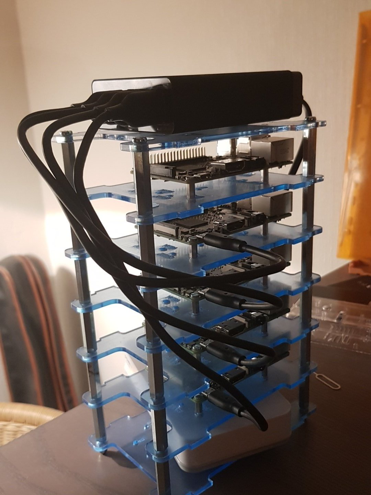

# Kubepi

Bash scripts I'm using to provision my raspberry kubernetes cluster.

## Should I be using this?

The short answer: **NO**!

The longer answer: I'm building this to learn more about kubernetes. It's not meant as something that will work anywhere to setup a raspberry cluster. It works only for me.  
If your intent is to learn too, then you can use this repository as a starting point but will need to hack on it to fully understand what it does and why it does it.

## Usage

### image.sh

This script will initialize an SD card with raspbian. All SD cards on the cluster need to be initialized with it.  
It expects the SD card to be connected directly to your computer with a card reader, not through a raspberry pi.

In addition to installing the OS, it will:

* Enable SSH on the host
* Enable cgroups on the host

### master.sh [node ip]

This script will setup the master node, which need to be the first one we setup.  
The master node will be used as:

* Wifi router. It will be the only node connecting to wifi, and will proxy internet connection to ethernet nodes.
* DHCP server, for the IP range 10.0.0.x.
* Kubernetes master node.

The host's hostname will always become `kubemaster`.  
At the end of this script, a new `raspberry` cluster will be configured locally. That cluster will also become your current one.

**Note**: As this is the first node to be setup, it needs another DHCP server on ethernet to have an easy to find IP address.

So the setup needs to happen in 2 steps. The first time, connect the node to the main DHCP server (your main wifi router) using ethernet.  
At the end of the DHCP setup, the script will tell you to reboot the machine on the permanent network. Rerunning the script will then pick things up.

### node.sh [node name] [node ip]

This script will setup a node. You can set any name you wish.  
The node will automatically be configured to connect to the master node on `10.0.0.1`.
